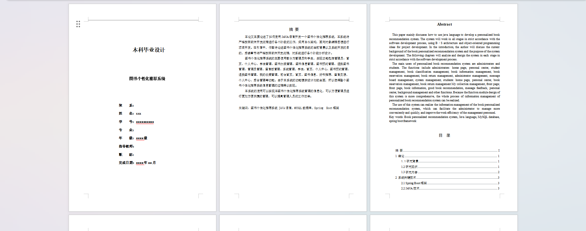
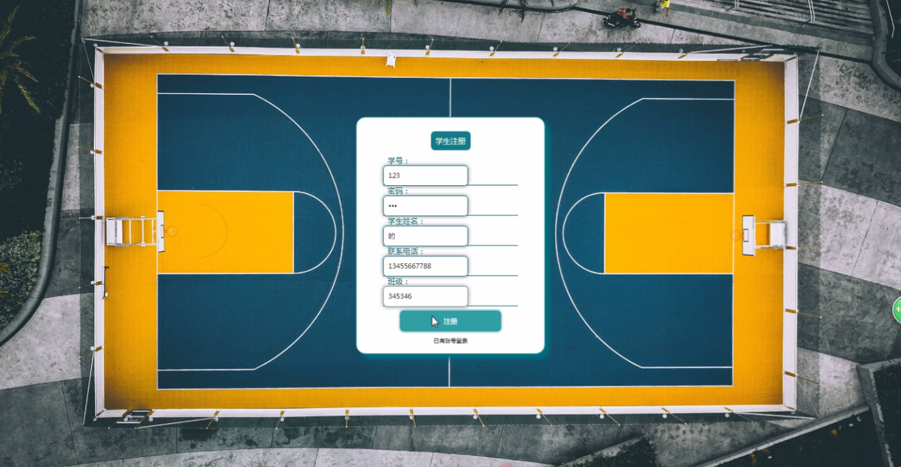
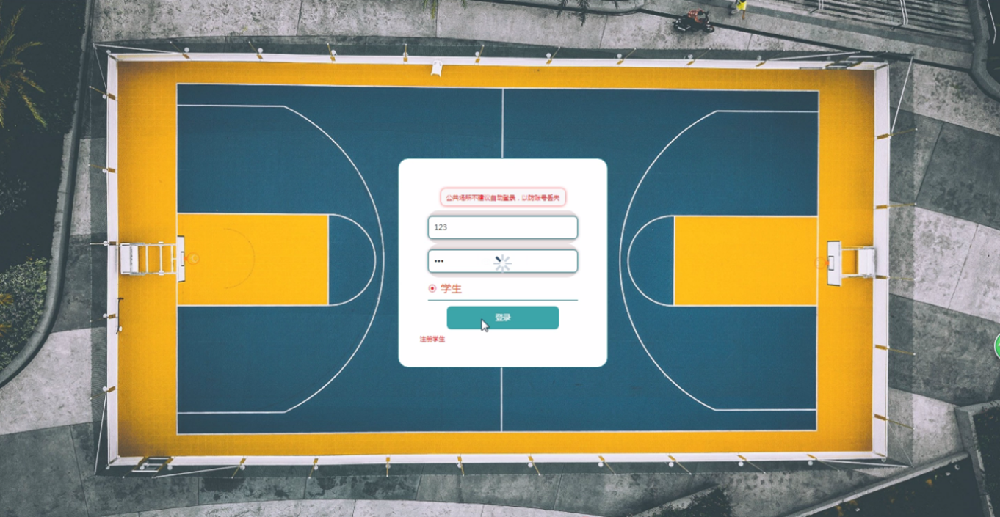
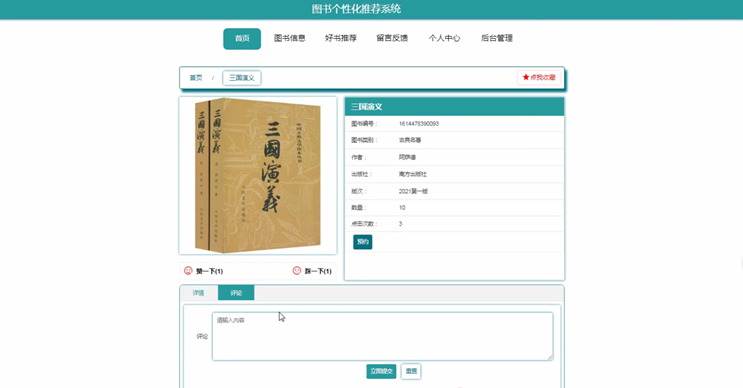
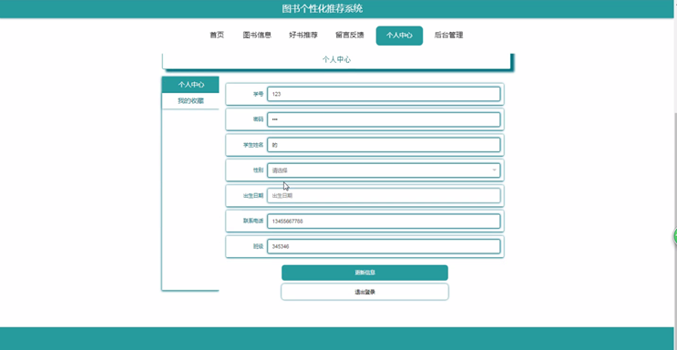
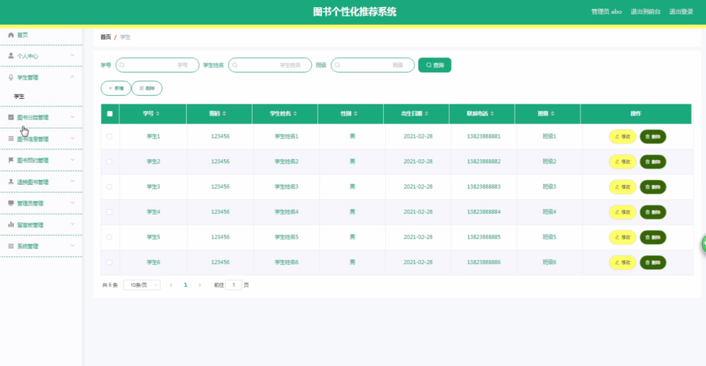

基于Springboot的图书个性化推荐系统（程序+论文）
=
### 完整代码获取地址：从戎源码网 ([https://armycodes.com/](https://armycodes.com/))
### 作者微信：19941326836  QQ：952045282 
### 承接计算机毕业设计、Java毕业设计、Python毕业设计、深度学习、机器学习
### 选题+开题报告+任务书+程序定制+安装调试+论文+答辩ppt 一条龙服务
### 所有选题地址https://github.com/nature924/allProject

一、项目介绍
---
系统包含两种角色：用户、管理员，系统分为前台和后台两大模块，主要功能如下：

### 1 前台首页功能模块
前台首页功能模块主要包括以下内容：

首页：展示系统的主要功能和信息。
图书信息：提供图书的详细信息，包括预约和收藏操作。
好书推荐：推荐学生可能感兴趣的好书。
留言反馈：允许用户留言并管理留言板。
个人中心：学生可以在这里更新个人信息和退出登录。
后台管理：管理员可以进入后台管理系统。

### 2 管理员功能模块
管理员功能模块包括以下内容：
管理员登录：通过用户名和密码登录系统。
学生管理：管理学生信息，包括修改和删除操作。
图书分类管理：管理图书的分类信息。
图书信息管理：管理图书的详细信息，包括修改、删除、预约等操作。
图书预约管理：管理图书的预约情况，包括审核和处理预约请求。
退换图书管理：管理学生的图书退换请求。
管理员管理：管理系统管理员的信息。
留言板管理：管理用户的留言和回复。
系统管理：管理系统的整体运行和设置。

### 3 学生功能模块
学生功能模块包括以下内容：

个人中心：学生可以查看和修改个人信息。
图书预约管理：学生可以预约图书，并查看预约状态。
退换图书管理：学生可以申请退换图书。
我的收藏管理：学生可以管理自己收藏的图书信息。

二、项目技术
---
- 编程语言：Java
- 数据库：MySQL
- 项目管理工具：Maven
- 前端技术：VUE、HTML、Jquery、Bootstrap
- 后端技术：Spring、SpringMVC、MyBatis

三、运行环境
---
- 操作系统：Windows、macOS都可以
- JDK版本：JDK1.8以上都可以
- 开发工具：IDEA、Ecplise、Myecplise都可以
- 数据库: MySQL5.7以上都可以
- Tomcat：任意版本都可以
- Maven：任意版本都可以

四、运行截图
---
### 论文截图：

### 程序截图：

